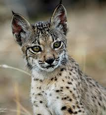
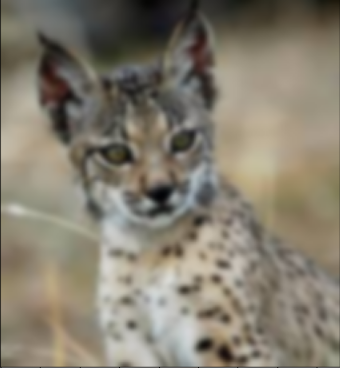
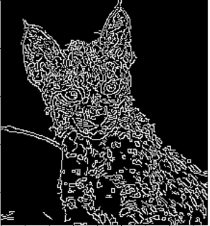
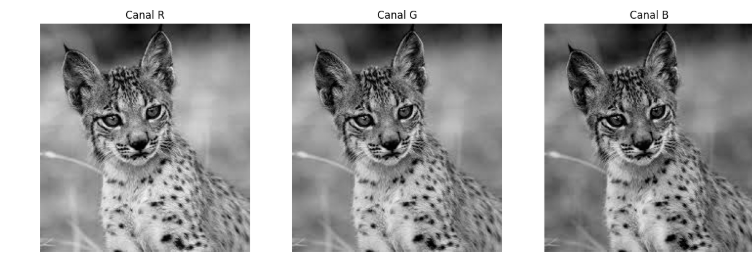
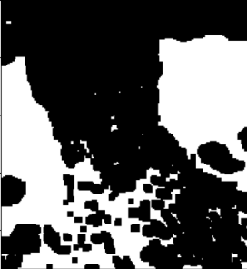
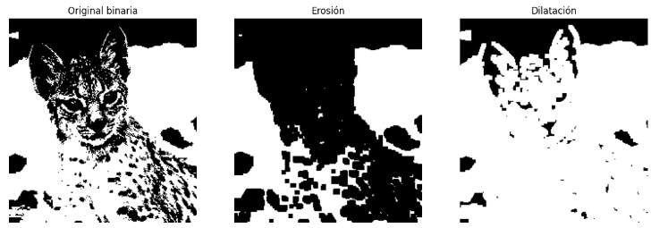
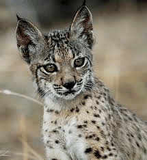

## Punto 1 – Análisis de Imagen de un Animal en Vía de Extinción
Este proyecto desarrolla técnicas básicas de procesamiento digital de imágenes utilizando Python, enfocadas en el análisis visual de una fotografía RGB de un animal en vía de extinción.
Incluye filtros, separación de canales, operaciones morfológicas y la creación de una animación GIF con los resultados.

---

## Contenido del proyecto

1. Carga y visualización de la imagen

        Se carga una imagen RGB desde archivo usando OpenCV.
        
        Se muestra la imagen en formato correcto (RGB).
        

2. Filtros básicos

    Se aplican dos filtros clásicos:
    
    🔹 Suavizado (Gaussian Blur)
    
    Reduce ruido y suaviza la textura general de la imagen.
    
    🔹 Realce de bordes (Canny)
    
    Resalta contornos importantes del objeto en la imagen.
    
    Ambos resultados se visualizan y se comentan en el notebook.

---

## Visualización de canales R, G y B

3. Visualización de canales R, G y B

    Se separan los canales individuales de la imagen.
    
    Cada canal se muestra en escala de grises.
    
    Se explica qué regiones aparecen más claras u oscuras dependiendo del canal (composición del color y sensibilidad del sensor).
    
### 4. Operaciones morfológicas
    Se trabaja sobre la imagen en escala de grises o binarizada.
    
    Se aplican dos operaciones:
    
    🔹 Erosión
    
    Reduce las zonas blancas y elimina ruido pequeño.
    
    🔹 Dilatación
    
    Engrosa formas blancas y rellena pequeños huecos.
    
    Los resultados se comparan frente a la imagen original/binarizada.

-   

### 5. Animación (GIF)

    Se genera un GIF mostrando:
    
    Imagen original
    
    Filtro de suavizado
    
    Realce de bordes
    
    Erosión
    
    Dilatación
    
    Esto permite visualizar la secuencia de transformaciones.
    

### Tecnologías utilizadas
    Python 3
    
    OpenCV (cv2)
    
    Matplotlib

    NumPy

 

